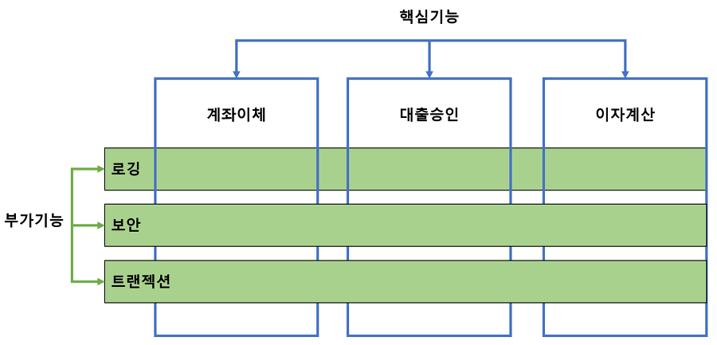
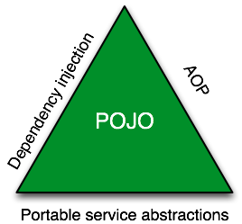

</img>

스프링으로 엔터프라이즈 웹 애플리케이션을 개발한지 2년이 조금 지났다. 그동안 자바스크립트, 데이터베이스등 여러가지 기술을 익혔는데 정작 스프링에 대해 생각해보니 딱 뭐라 정의 할 수가 없었다. 이제 자바와 스프링을 땔 수 없는 관계인 것 같다. 그래서 스프링에 대해 정리를 하려고 한다.

## 1. 스프링의 등장 배경

### 1-1. 기존 기술의 문제

새로운 기술의 등장은 이미 사용 중인 기술의 불편함과 문제점을 해결하고자 하는데서 비롯된다. 스프링 이전에는 자바 엔터프라이즈 프레임워크로 `EJB(Enterprise Java Bean)`가 많이 쓰였다고 한다. 당시 EJB는 기술에 대한 과도한 욕심으로 인해 개발환경과 운영서버, 개발과 테스트 등의 과정을 모두 무겁고 복잡하게 만들었다. 또한 EJB가 동작하려면 고가의 느리고 무거운 자바 WAS가 필요했고 다루기 힘든 난해한 설정 파일 구조 등 여러모로 개발하기 힘든 환경이였다. 이러한 상황 속에서 로드 존슨이라는 사람이 2002년 `Expert One-on-One J2EE Design and Development`이라는 책을 출판했다. 이 책에서 강조하는 전략 중 하나는 "항상 프레임워크 기반으로 접근하라"는 것이었다. 책에 수록된 3만줄 가량의 예제 애플리케이션은 프레임워크를 먼저 만들고 나서 프레임워크를 이용하는 코드를 만드는 방식으로 개발되었다. 바로 이 예제에 포함된 프레임워크가 스프링 프레임워크의 기원이다.

### 1-2. 엔터프라이즈 시스템은 복잡하다

엔터프라이즈 시스템은 기업의 비지니스를 돕기 위한 IT 시스템을 뜻한다. 다양한 비즈니스 환경에서 엔터프라이즈 시스템은 아래와 같은 특징을 제공해야 한다고 한다.

- 안정성
- 권한 제한과 강력한 보안
- 모니터링
- 관리 툴

등등... 엔터프라이즈 시스템은 기업이 요구하는 비지니스 로직을 구현하는 것 외에도 위에서 언급한 사항들을 충족해야한다. 이것이 엔터프라이즈 시스템 개발을 어렵게 만드는 요소이다. 이러한 기술적인 부분을 충족시키기 위해 비지니스 로직 사이사이에 로깅, 트랜잭션, 권한 체크 등과 관련된 코드를 작성하다 보면 개발과 유지보수에 대한 비용이 많이 증가할 것이다. 그렇다고 복잡함을 감소시키고자 보안에 취약한 시스템을 만들 수는 없다. 기술적인 부분의 복잡함은 제거 대상이 아니다. 해결해야 하는 대상이다.

## 2. 복잡함을 해결하자

### 2-1. 실패한 해결책 EJB

EJB도 위에서 언급한 문제를 해결하고자 등장하였고 기술적인 부분을 핵심 비지니스 로직에서 일부분 분리하는데 성공하였다. 문제는 EJB 환경에서 동작하기 위해 특정 인터페이스를 구현하고, 특정 클래스를 상속하고, 서버에 종속적인 서비스를 통해서만 접근과 사용이 가능하다는 것이였다. 결국 EJB를 사용하면 자바의 객체지향적인 특성을 잃어버리게 되는 것이다.

### 2-2. 스프링에선?

스프링은 기술적인 부분과 핵심 비지니스 로직을 깔끔하게 분리하면서도 코드상에 스스로를 불필요하게 노출하지 않는다. 또한 특정 환경과 서버에 종속되지 않고, 적용되는 기술이 달라져도 수정되지 않는 코드를 작성하게끔 도와준다.

## 3. 스프링의 전략

### 3-1. 기술적인 부분과 핵심 비지니스 로직을 분리하는 전략

앞에서도 살펴봤듯이 기업이 요구하는 핵심 비지니스 로직 전후에 설정되어야 하는 트랜잭션, 권한 체크등이 엔터프라이즈 시스템이 갖춰야하는 기능이다. 이런 기능과 비지니스 로직을 분리하는 스프링의 전략은 `AOP`이다. 구글에 검색한 AOP(Aspect Oriented Programming)의 정의는 이렇다.

> ["관점 지향 프로그래밍(aspect-oriented programming, AOP)은 횡단 관심사(cross-cutting concern)의 분리를 허용함으로써 모듈성을 증가시키는 것이 목적인 프로그래밍 패러다임이다." ](https://ko.wikipedia.org/wiki/%EA%B4%80%EC%A0%90_%EC%A7%80%ED%96%A5_%ED%94%84%EB%A1%9C%EA%B7%B8%EB%9E%98%EB%B0%8D)

횡단 관심사라는 어려운 단어가 등장하지만 그냥 핵심 기능 사이 사이의 부가기능이라 생각하면 된다. 이렇듯 스프링은 `핵심기능(비지니스 로직)`과 `부가기능(엔터프라이즈 기술)`을 분리하는 AOP라는 기술로 복잡함을 해결한다. AOP에 관해서는 나중에 더 자세히 다뤄야겠다.

</img>
 

### 3-2. 특정 환경과 기술에 종속되지 않는 코드를 작성하게끔 해주는 전략

스프링은 서비스 추상화를 통해 특정 환경과 기술에 종속되지 않는 독립적인 코드를 작성하게 도와준다. 추상화의 정의는 이렇다.

> ["컴퓨터 과학에서 추상화(abstraction)는 복잡한 자료, 모듈, 시스템 등으로부터 핵심적인 개념 또는 기능을 간추려 내는 것을 말한다."](<https://ko.wikipedia.org/wiki/%EC%B6%94%EC%83%81%ED%99%94_(%EC%BB%B4%ED%93%A8%ED%84%B0_%EA%B3%BC%ED%95%99)>)

일반적인 용어로서의 추상화도 요소들의 복잡함을 감추고 핵심적인 것만 남겨 표현한다는 것이다. 자바 관점에서 보면 구체적인 기술 구현 부분과 그 구현체를 사용하는 인터페이스를 분리하는 것이라고 볼 수 있다. 구글에 '스프링 서비스 추상화'를 검색해 봤을 때 토비 선생님의 트랜잭션 서비스 추상화에 관련된 글이 가장 많았다. 트랜잭션 서비스 추상화의 핵심은 다양한 데이터 접근방법(JDBC Connection, 하이버네이트 등등)들을 추상화하여 데이터 접근방법에 독립적인 코드를 만드는 것에 있다.

### 3-3. 전략을 수행하기 위한 핵심 도구

앞에서 살펴본 스프링의 두 가지 전략, AOP와 서비스 추상화는 의존성 주입(DI)를 바탕으로 구현된다. 여기서 DI란 코드상의 있는 의존성을 외부에서 설정하는 기술이다.
그리고 DI는 객체지향 설계 없이는 그 존재 의미가 없다. 스프링은 단지 DI, AOP, 서비스 추상화와 같은 기술을 편하게 사용할 수 있게 도와줄 뿐이다. 이러한 기술들은 스프링만의 기술이 아니다. 객체지향언어를 더욱 더 객체지향적으로 만들어 주는 기법일 뿐이다. 스프링은 단지 자바의 객체지향적인 특성을 살리도록 도와주는 녀석이다. **결국 스프링이 엔터프라이즈 시스템의 복잡함을 해결하고자 사용했던 핵심 도구는 객체지향이다.**

## 4. 스프링의 핵심

### 4-2. 핵심은 POJO

스프링의 핵심 개발자들이 함께 쓴 Professional Spring Framework라는 책에서 스프링 핵심 개발자들은 "스프링의 정수는 엔터프라이즈 서비스 기능을 POJO에 제공하는 것"이라고 했다. 여기서 POJO란 무엇일까?

> ["Plain Old Java Object, 간단히 POJO는 말 그대로 해석을 하면 오래된 방식의 간단한 자바 오브젝트라는 말로서 Java EE 등의 중량 프레임워크들을 사용하게 되면서 해당 프레임워크에 종속된 "무거운" 객체를 만들게 된 것에 반발해서 사용되게 된 용어이다."](https://ko.wikipedia.org/wiki/Plain_Old_Java_Object)

POJO라는 단어를 만든 마틴 파울러는 다음과 같이 그 기원을 밝혔다.

> ["우리는 사람들이 자기네 시스템에 보통의 객체를 사용하는 것을 왜 그렇게 반대하는지 궁금하였는데, 간단한 객체는 폼 나는 명칭이 없기 때문에 그랬던 것이라고 결론지었다. 그래서 적당한 이름을 하나 만들어 붙였더니, 아 글쎄, 다들 좋아하더라고."](https://ko.wikipedia.org/wiki/Plain_Old_Java_Object)

아래 그림은 스프링 소스의 CTO인 아드라인 콜리어가 스프링의 핵심 개념을 설명하기 위해 만든 그림이다. 그림에서도 알 수 있듯이 스프링의 핵심은 DI, AOP, 서비스 추상화를 통해 복잡한 엔터프라이즈 기능을 구현하고 핵심 비지니스 로직을 담은 POJO에 제공하는 것이다.

</img>
 

### 4-3. POJO의 조건

POJO는 평범한 자바오브젝트라는 뜻이지만 다음의 세 가지 조건을 충족해야한다.

- 특정 규약에 종속되지 않아야 한다.
- 특정 환경에 종속되지 않아야 한다.
- 책임과 역할이 다른 코드를 한 클래스에 몰아 넣은 덩치 큰 만능 클래스가 아니여야 한다.

**결국 POJO란 객체지향적인 원리에 충실하면서, 특정 환경과 기술에 종속되지 않고 필요에 따라 재활용될 수 있는 방식으로 설계된 오브젝트를 뜻한다.**

## 5. 결론

위에서 정리한 내용으로 내 나름 스프링을 정의하자면 이렇다.

> **"IoC/DI, AOP, PSA와 같은 객체지향 기술로 자바 엔터프라이즈 개발을 편하게 해주고 애플리케이션 전반에 걸쳐 POJO를 중심으로 객체지향적 개발을 할 수 있게 도와주는 애플리케이션 프레임워크"**

2년 넘게 스프링으로 웹 개발을 했는데 막상 생각해보면 "와 스프링을 엄청 사용해서 개발했다!!!" 라는 생각이 들지 않는다. 스프링은 초기 설정을 하고 나면 소스상에 모습을 쉽게 드러내지 않는다. 그래서 더 무관심 했던 것 같다. 그런 의미에서 스프링이 정말 잘 만들어진 프레임워크라는 것을 새삼 깨닫는다. 여담으로 스프링이라는 이름의 의미는 EJB의 시대를 겨울(Winter)로 정의하고, 이젠 봄(Spring)이 왔다는 의미라고 한다.

    
출처: https://12bme.tistory.com/157
