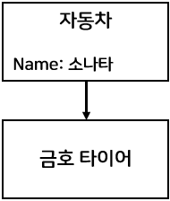
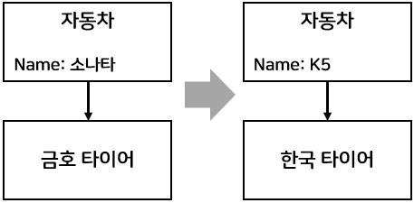
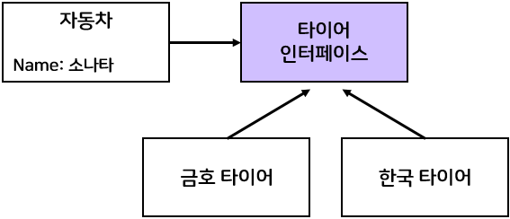

## IoC컨테이너

앞의 글에서 스프링의 핵심은 POJO라고 했다. 스프링에선 이러한 POJO 인스턴스를 new 연산자로 만드는 것이 아니라 IoC컨테이너가 POJO를 구성하고 관리한다.
그런데 IoC는 뭐고 컨테이너는 무엇인가?

**IoC(Inversion of Control), 제어의 역전**을 알아보기 전에 일단 SOLID 원칙 중 하나인 **DIP(Dependency Inversion Principle)**에 대해 알아보자. DIP(의존성 역전 원칙)는 다음과 같이 정리할 수 있다.

> - 상위(고차원) 모듈이 하위(저차원)모듈에 의존해서는 안된다. 상위 모듈과 하위 모듈 모두 추상화에 의존해야 한다.
> - 추상적인 것은 구체적인 것에 의존해서는 안된다. 구체적인 것이 추상적인 것에 의존해야 한다.

예를 들어 아래와 같은 코드가 있다고 하자. 자동차 객체는 엔진과 타이어같은 객체를 조립하여 만드는데, 소나타라는 이름을 가진 자동차 객체를 만들기 위해 금호타이어 객체가 필요한 상황이다. 이렬 경우 자동차 객체가 금호타이어 객체에 의존한다. 고로 상위 모듈이 하위 모듈에 의존하고 있다.

<!-- <div style="width: 15%; height: 15%; margin: 0 auto;"> -->

</img>

<!-- </div> -->
<br/>

처음 자동차 클래스를 구상할 땐 여러가지 부품을 조립하여 여러 종류의 자동차를 만드는 재사용 가능한 클래스로 구상하였다. 그래서 자동차 클래스로 소나타말고 K5를 만든다고 하자. 그런데 K5는 금호 타이어 객체가 아닌 한국 타이어 객체를 사용해야 하는 상황이라면 어떻게 해야할까? 아마도 자동차 클래스의 금호타이어와 관련된 부분을 모두 한국타이어로 수정해야 할 것이다. `결국 자동차 클래스는 재사용 불가능한 클래스가 되버렸다.`

<!-- <div style="width: 50%; height: 50%; margin: 0 auto;"> -->

</img>

<!-- </div> -->
<br/>

자바에서는 인터페이스를 통해 아래 그림과 같이 의존성 역전 원칙을 지킬 수 있다. 자동차 객체는 타이어 인터페이스( _추상적인 것_ )에 의존하고 타이어 인터페이스를 구현한 금호타이어와 한국타이어( _구체적인 것_ )는 다시 타이어 인터페이스에 의존한다. `이렇게 의존성 역전 원칙을 준수하여 설계 하면 객체간의 결합도를 낮출 수 있다.`

</img>
<br/>

**컨테이너(Container)**라고 하면 보통 직사각형의 화물 수송용 컨테이너같은 무엇인가를 담는 용기 또는 그릇을 뜻한다. 그와 비슷하게 프로그래밍 세계에선 보통 `인스턴스를 담고 인스턴스의 생명주기 관리와 추가적인 기능을 제공하는 것을 컨테이너라고 한다.`

```java
public class Car {
	private String name;
	private KumhoTire tire;

	public Car(String name, KumhoTire tire) {
		this.name = name;
		this.tire = tire;
	}

	public String getName() {
		return name;
	}
	public void setName(String name) {
		this.name = name;
	}
	public KumhoTire getTire() {
		return tire;
	}
	public void setTire(KumhoTire tire) {
		this.tire = tire;
	}

	public String getCarInfo() {
		StringBuilder builder = new StringBuilder();

		builder.append("차 이름: " )
			.append(this.getName())
			.append("  타이어 종류: ")
			.append(this.getTire().getName());

		return builder.toString();
	}
}

```
